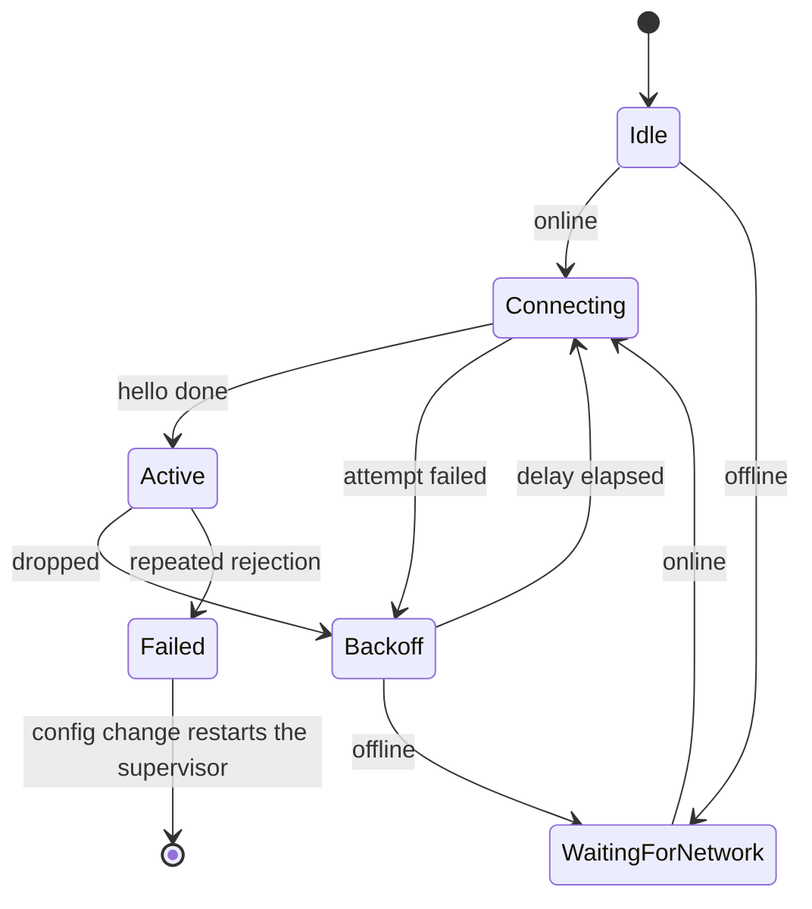

# Sendspin local player

The `:sendspin` module is the Music Assistant Sendspin client for the `player@v1` role. It
connects to a Sendspin server, keeps an encrypted session, and follows the server clock. It plays
the audio stream in time with the other players in a group. The connection is always encrypted:
there is no plaintext session. The module is a pure Kotlin Multiplatform leaf. It depends on no
other Gradle project. It contains no Compose code, no Koin code, and no `expect`/`actual`
declaration. Each platform difference is an interface that the application implements.

This file documents the module from the outside, as a client of it sees it. Each package
documents its own rules in KDoc next to the code. The cryptography, the specification mapping,
and the test vectors are in
[`noise/README.md`](src/commonMain/kotlin/io/music_assistant/sendspin/noise/README.md).

## Scope

The module does this work:

- Transport, Noise encryption, and the session state machine.
- Client identity, trust records, and pairing.
- Server clock synchronization.
- Audio buffering, decode dispatch, and output scheduling.

The module does not do this work:

- **No control plane.** Play, pause, seek, and queue commands go over the Music Assistant API in
  the application. The module sends `player@v1` messages only.
- **No WebRTC.** For a data-channel connection the application supplies
  `Endpoint.WebRtc(openChannel)`, and the module calls it once per attempt.
- **No platform audio.** `AudioSink` and `DecoderFactory` are ports.
- **No settings and no text.** The module never writes application settings and holds no
  user-facing string. It reports codes, and the application maps them to resources.

## Design goals

1. One owner per piece of state.
2. One reconnect policy, in one pure object.
3. Bounded queues everywhere. Nothing on the audio path grows without a limit.
4. Structured concurrency. Cancellation is the only teardown.
5. The audio pipeline outlives the connection, so buffered audio drains through a reconnect.
6. A small public surface, enforced by `internal` and checked by the compiler.

## Use the module

### Entry point

One function creates the player. It is the only public function outside the `api` package.

```kotlin
fun SendspinPlayer(
    config: StateFlow<LocalPlayerConfig?>,
    deps: SendspinDeps,
    scope: CoroutineScope,
): SendspinPlayer
```

The player runs for the life of `scope`. It has no `start` and no `stop`: a `null` config
disables it, and that is the only stop.

The package `io.music_assistant.sendspin.api` plus this factory are the whole public surface.
Every other declaration in the module is `internal`, so the compiler rejects a leak into the
application.

### Configuration

`LocalPlayerConfig` has two classes of field: ones that cause a reconnection when they change,
and ones that do not.

| Field | Causes reconnect? | Effect of a change |
| --- | --- | --- |
| `endpoint` | Yes | Restarts the connection. The audio pipeline is untouched. |
| `deviceName` | Yes | Restarts the connection. |
| `codecPreference` | Yes | Restarts the connection. |
| `userDelayMs` | No | Applies to the next scheduled chunk. |
| `bufferCapacityBytes` | No | Applies to the buffer now. Advertised at the next hello. |

Clients should keep the same `Endpoint` instance while the endpoint did not change.
`Endpoint.WebRtc` compares by identity, so a new instance restarts the connection.

### Ports the application implements

| Port | Purpose |
| --- | --- |
| `AudioSink` | Platform audio output. `open` builds a new device stream each time. |
| `DecoderFactory` | Creates one `AudioDecoder` for a codec. |
| `SendspinKeyStore` | Byte-blob storage for identity and trust. Reads never throw. |
| `SendspinTransport` | Frames over one WebRTC data channel. |

`SendspinDeps` also takes the application's `HttpClient`, an `online` flow, an `approvePairing`
call, and the audio dispatcher.

A decoder can be a **pass-through**: it returns `outputCodec != PCM`, and the sink decodes the
bytes itself. iOS works this way. The scheduler then treats the bytes as opaque. It cannot trim,
pad, or resample them, so it schedules open loop. See the KDoc on `Scheduler`.

### Authentication and pairing

The module holds no credential of its own. It needs two things from the application, and both
exist because Music Assistant hosts the Sendspin server.

**The Music Assistant token is the price of entry to the proxy, not to Sendspin.**
`Endpoint.WebSocket` carries a token because the default URL is the Music Assistant socket at
`<server>/sendspin`. Music Assistant puts the Sendspin server behind the same authenticated
reverse proxy as its control socket, so a client needs one open port and one credential. The
module sends `auth` and waits for `auth_ok` before the Sendspin protocol starts. This exchange
is the proxy's, not Sendspin's. A WebRTC data channel skips it, because the channel is already
proven.

**`approvePairing` pairs the player without a person.** A Sendspin server does not accept an
unknown player on its own. It shows a pairing code, and a person approves the code. A Sendspin
server also accepts a pairing token that arrives over a channel it already trusts. That second
route needs no person.

The module mints the token, but it cannot deliver it. It speaks one protocol on one socket, and
it holds no control plane. So it gives the token to the application, and the application gets
the token approved. The module asks when a session comes up unpaired. The module asks again
after a server-side unpair, so the player returns on the next reconnect.

Music Assistant supplies the trusted channel: the application spends the token on the
`sendspin/pair_web_player` command of its own API connection. An application that pairs by the
code supplies an `approvePairing` that does nothing.

### State and events

`state` is a `StateFlow<PlayerState>`.

| State | Meaning |
| --- | --- |
| `Disabled` | The config is `null`. |
| `Connecting(attempt)` | An attempt is in progress. |
| `Connected(...)` | The session is up. Carries the player id, the server name, the clock quality, and the audio status. |
| `Reconnecting(...)` | The connection dropped and a retry is scheduled. `nextRetryAtMs` is `null` while the module waits for the network. |
| `Failed(cause)` | The module gave up. It leaves this state only on a config change. |

`events` is a buffered `Flow<PlayerEvent>`. A slow collector loses the oldest event.

| Event | The application must |
| --- | --- |
| `PlaybackStarted` | Nothing. The first audio reached the sink. |
| `PlaybackStopped(cause)` | Nothing. Show the cause if it helps the user. |
| `ServerRefreshNeeded` | Refetch the player list. The server assigned or changed the player id. |
| `FocusRegained` | Resume playback if the user wants it. |
| `Warning(code)` | Show a notice. The module already recovered or degraded. |

## Connection lifecycle



`ConnectionSupervisor` runs one attempt at a time. Every attempt ends with a `DropReason`, and
`ReconnectPolicy` turns it into one of three decisions: retry after a delay, wait for the
network, or fail. Only repeated rejections can fail, because the first rejections are expected
while the pairing call is still in flight. The backoff is exponential with jitter and a cap, and
it is unlimited while the device is online.

Offline is not a timer. The supervisor waits on the `online` flow and attempts again at once when
the network returns.

A reconnect does not stop the audio. The pipeline outlives the connection, so audio that is
already buffered keeps playing, and a stream that resumes in the same format is not rebuilt.
